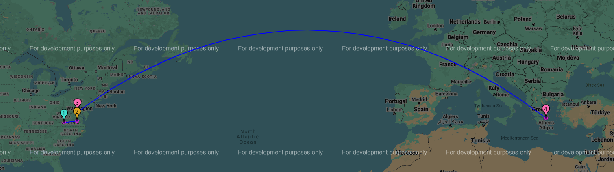

<div align="center"></a>

# Traceroute Visualizer

### See your internet connection's journey!



### Run a `traceroute` on a domain of your choosing and generate an interactive Google Maps that shows the path your data took to reach the domain!
#### Project for CS 2104: Introduction to Problem Solving in CS

<div align="left"></a>

## Dependencies

Requires [Python](https://www.python.org/) 3.6 or higher and the following Python libraries:
- `scapy` For running the traceroute.
- `requests` For getting the geolocation of an IP from a resolver.
- `gmplot` For generating the Google Maps plot of the traceroute.

As well as [Npcap](https://npcap.com/) for Windows, which `scapy` depends on for packet sniffing.
<br>
<br>
Run the following Python command to install the required Python dependencies:</br>
```
pip install scapy requests gmplot
``` 

## Usage
Simply run the program with a commandline argument of the URL to traceroute or run without args and enter the URL in the console when prompted.

Example:
```console
$ python traceroute_mapper.py google.com

Tracerouting 'google.com'...
Mapping traceroute...
Traceroute successfully mapped and saved as 'traceroute_map.html' in 'C:\traceroute-visualizer'
```

```console
$ python traceroute_mapper.py

Enter the URL to run a traceroute on (ex: google.com, github.com): google.com
Tracerouting 'google.com'...
Mapping traceroute...
Traceroute successfully mapped and saved as 'traceroute_map.html' in 'C:\traceroute-visualizer'
```
